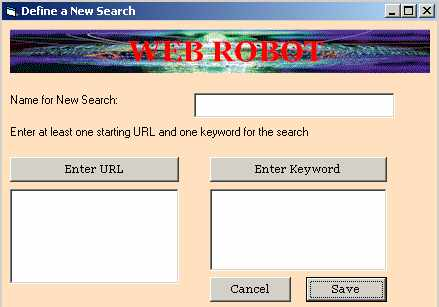



## Web Robot

### Description

This is a web robot which can crawl the internet to search the keywords entered by the user. Its a complete application where users can enter the keywords and the relevance level to search the keywords. Min relevance is 0 and max is 10. Default relevance is 5. The bot crawls the internet and store the results in a database. This is a very useful program and it can be converted into a component to use it on the internet.
 
### More Info
 

             |
---                |---
**Submitted On**   |2001-11-12 18:44:44
**By**             |[S\.S\. Ahmed](https://github.com/Planet-Source-Code/PSCIndex/blob/master/ByAuthor/s-s-ahmed.md)
**Level**          |Advanced
**User Rating**    |4.6 (23 globes from 5 users)
**Compatibility**  |VB 5\.0, VB 6\.0, ASP \(Active Server Pages\) 
**Category**       |[Complete Applications](https://github.com/Planet-Source-Code/PSCIndex/blob/master/ByCategory/complete-applications__1-27.md)
**World**          |[Visual Basic](https://github.com/Planet-Source-Code/PSCIndex/blob/master/ByWorld/visual-basic.md)
**Archive File**   |[Web\_Robot3474011122001\.zip](https://github.com/Planet-Source-Code/s-s-ahmed-web-robot__1-28838/archive/master.zip)

